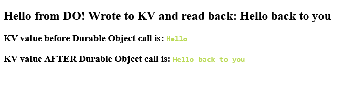

# SvelteKit Durable Object Local Usage Example

A production-ready example demonstrating how to build a full-stack application with a **SvelteKit** frontend and a **Cloudflare Durable Object** stateful backend, complete with seamless local development support.

## 📋 Overview

This monorepo showcases best practices for integrating Cloudflare Durable Objects with SvelteKit applications. It provides a unified local development experience where both the frontend and backend run together, allowing you to develop and test your application as if it were deployed to Cloudflare's edge network.

### What are Durable Objects?

[Durable Objects](https://developers.cloudflare.com/durable-objects/) are Cloudflare's solution for building stateful applications. Unlike traditional serverless functions that are stateless, Durable Objects maintain state and allow coordinated access from multiple clients, making them ideal for real-time applications, collaborative tools, and persistent data operations.

## 📁 Project Structure

This monorepo consists of two main applications:

### **Backend: `do-kv-worker`**
A Cloudflare Worker that defines and exposes a Durable Object instance. This service:
- Manages stateful data and logic at the edge
- Provides API endpoints that the frontend consumes
- Uses KV storage for persistent data
- Handles all business logic and state coordination

### **Frontend: `sveltekit-do-app`**
A modern SvelteKit application serving as the user interface:
- Communicates with the Durable Object backend via HTTP/fetch
- Uses [`getPlatformProxy`](https://developers.cloudflare.com/workers/wrangler/api/#getplatformproxy) to access local Durable Objects during development
- Fully configured to work seamlessly with the local Durable Object instance

## 🚀 Quick Start

### Prerequisites
- **Node.js** 18.0 or higher
- **pnpm** (or npm/yarn)
- **Wrangler CLI** (installed as a dependency)

### Installation

1. **Install dependencies** across the monorepo:
```sh
pnpm i
```

2. **Start the development environment**:
```sh
pnpm start
```

This single command:
- Starts the Durable Object worker locally using Wrangler
- Automatically launches the SvelteKit development server
- Enables both apps to communicate as if deployed to Cloudflare

### Testing Locally

Once running, open your browser and navigate to:
```
http://localhost:5173/
```

You should see the SvelteKit application with data being fetched from the local Durable Object:



The page displays a message retrieved from the Worker's Durable Object backend, confirming that both apps are communicating correctly.

## 🔗 How It Works

The key to seamless local development is the **Platform Proxy** integration:

1. **SvelteKit Configuration** (`svelte.config.js`):
   - Specifies the workers directory in the platform proxy configuration
   - Ensures both apps use the same KV namespace instance
   - Allows SvelteKit to access the local Durable Object as if it were on Cloudflare's edge

2. **Development Script** (`dev.mjs`):
   - Orchestrates starting the Durable Object worker
   - Automatically starts the SvelteKit dev server after the worker is ready
   - Manages the shared environment for both applications

3. **Communication**:
   - Frontend makes fetch requests to the Durable Object API
   - Backend handles requests and manages state
   - All requests stay local during development, then go through Cloudflare when deployed

## 📦 Deploying to Cloudflare

Ready to go live? Follow these steps:

### Step 1: Create a KV Namespace

First, create a Cloudflare KV namespace for storing persistent data:

```sh
pnpm dlx wrangler kv namespace create EXAMPLE_KV
```

Note the namespace ID returned by this command.

### Step 2: Update Configuration Files

Update the `wrangler.toml` files in both the `do-kv-worker` and `sveltekit-do-app` directories with your new KV namespace ID:

```toml
kv_namespaces = [
  { binding = "EXAMPLE_KV", id = "your-namespace-id-here" }
]
```

### Step 3: Deploy Both Applications

Deploy the backend worker first:

```sh
cd do-kv-worker
pnpm run deploy
```

Then deploy the SvelteKit application:

```sh
cd ../sveltekit-do-app
pnpm run deploy
```

## 📚 Additional Resources

- [Cloudflare Durable Objects Documentation](https://developers.cloudflare.com/durable-objects/)
- [Cloudflare Workers Documentation](https://developers.cloudflare.com/workers/)
- [SvelteKit Documentation](https://kit.svelte.dev/)
- [getPlatformProxy API Reference](https://developers.cloudflare.com/workers/wrangler/api/#getplatformproxy)
- [Wrangler CLI Documentation](https://developers.cloudflare.com/workers/wrangler/)

## 💡 Key Features

✅ **Unified Local Development** - Frontend and backend run together locally  
✅ **State Management** - Durable Objects handle coordinated state  
✅ **KV Integration** - Persistent storage with Cloudflare KV  
✅ **Production Ready** - Same setup works during development and after deployment  
✅ **Type Safe** - Full TypeScript support in both frontend and backend  

## 🤝 Contributing

Feel free to fork this repository and use it as a starting point for your own Cloudflare + SvelteKit projects!

## 📄 License

This project is open source and available under the MIT License.

